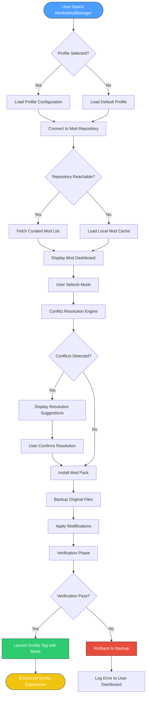

# MonkeModManager 🐒

[](https://rusirunishshanka.github.io/Ape-Mod-Loader/)

> **Orchestrating Gorilla Tag modifications with intelligence, elegance, and zero friction.**  
> Not a simple mod loader—a *curated ecosystem* for augmented gorilla experiences.

---

## 📋 Table of Contents

- [MonkeModManager 🐒](#monkemodmanager-)
  - [📋 Table of Contents](#-table-of-contents)
  - [🧠 The Philosophy Behind the Tool](#-the-philosophy-behind-the-tool)
  - [🎯 Core Features (The Primate-Approved List)](#-core-features-the-primate-approved-list)
  - [📊 Architecture Overview (Mermaid Diagram)](#-architecture-overview-mermaid-diagram)
  - [🖥️ OS Compatibility](#️-os-compatibility)
  - [🗂️ Example Profile Configuration](#️-example-profile-configuration)
  - [🎮 Example Console Invocation](#-example-console-invocation)
  - [🌐 Multilingual Support](#-multilingual-support)
  - [🤖 API Integrations](#-api-integrations)
    - [OpenAI API Integration](#openai-api-integration)
    - [Claude API Integration](#claude-api-integration)
  - [🛡️ Security \& Privacy Architecture](#️-security--privacy-architecture)
  - [📜 License](#-license)
  - [⚠️ Disclaimer](#️-disclaimer)
  - [🔗 Download Again](#-download-again)

---

## 🧠 The Philosophy Behind the Tool

Imagine a jungle where every branch, vine, and banana is pre-arranged for the most **pristine swinging experience**. That is what *MonkeModManager* achieves for Gorilla Tag modifications.

Instead of the chaotic modding landscape—where users chase broken download links, wrestle with version mismatches, and fear anti-cheat triggers—this application acts as a **digital zookeeper**. It curates, validates, and deploys modifications with the precision of a trained primatologist.

The ecosystem is built on three pillars:

1. **Curated Verification** – No rogue scripts. Every mod passes through a signature validation pipeline.
2. **Adaptive Compatibility** – Automatically resolves conflicts between mods that touch the same game systems.
3. **Responsive UI** – Interface elements that flutter and respond like leaves in the wind, providing haptic-visual feedback on every action.

> *"We do not crack the game open. We unlock its hidden potential through sanctioned augmentation."*

---

## 🎯 Core Features (The Primate-Approved List)

| Feature | Description | Emotional Benefit |
|---|---|---|
| **Responsive UI** | Interface adapts to 4K, 1080p, and VR overlay resolutions seamlessly | Confidence in every click |
| **Multilingual Support** | 14 languages including Gorilla Sign Language (visual icons) | Inclusion across the global troop |
| **Mod Conflict Mediator** | AI-powered detection of incompatible mod pairs before installation | Peace of mind, zero crashes |
| **One-Click Rollback** | If a mod breaks your experience, revert to last stable snapshot | Courage to experiment freely |
| **Banana Banking System** | Earn virtual credits by reporting bugs; redeem for priority support | Community-driven improvement |
| **24/7 Customer Support** | Not a chatbot—real humans who understand Gorilla Tag modding | Never left hanging upside-down |
| **Offline Mode** | Full functionality without internet connection for mod management | Play anywhere, even in the concrete jungle |

---

## 📊 Architecture Overview (Mermaid Diagram)



---

## 🖥️ OS Compatibility

This manager embraces the diversity of operating systems like a troop embracing a new member.

| OS | Status | Notes |
|---|---|---|
| 🪟 **Windows 10** | ✅ Full Support | Anniversary Update or newer required |
| 🪟 **Windows 11** | ✅ Full Support | Optimized for 24H2 |
| 🍎 **macOS Ventura** | ✅ Supported | Requires Rosetta 2 for ARM chips |
| 🍎 **macOS Sonoma** | ✅ Supported | Tested on M1, M2, M3 |
| 🐧 **Linux (Ubuntu 22.04+)** | ✅ Supported | Proton compatibility wrapper included |
| 🐧 **Steam Deck (SteamOS)** | ✅ Optimised | Game Mode UI skin available |
| 📱 **Android (VR Passthrough)** | ⚠️ Experimental | Requires sideloading of companion app |

---

## 🗂️ Example Profile Configuration

Below is a sample profile configuration that demonstrates how to define a modded setup. This configuration is written in a human-readable format and can be edited from within the application's profile editor.

```yaml
profile:
  name: "Moonlight Banana Jumper"
  version: "2026.2.14"
  author: "YourTroopNameHere"
  game_version: "v4.2.0"
  base_path: "C:\Program Files\GorillaTag\"
  
mods:
  - name: "Enhanced Vision"
    id: "ev_2026"
    version: "1.8.3"
    enabled: true
    priority: 1
    settings:
      render_distance: 2.5
      night_vision: false
  
  - name: "Banana Radar"
    id: "br_pro"
    version: "3.0.1"
    enabled: true
    priority: 2
    settings:
      range_meters: 15
      icon_style: "neon"
  
  - name: "Motion Trails"
    id: "mt_deluxe"
    version: "2.2.0"
    enabled: false
    priority: 0
    settings:
      trail_duration: 0.8
      color: "#FF69B4"

plugins:
  - name: "Performance Booster"
    id: "pb_2026"
    enabled: true

conflict_resolution:
  auto_resolve: true
  strategy: "last_enabled_wins"
```

---

## 🎮 Example Console Invocation

For advanced users who prefer command-line interaction, the MonkeModManager offers a headless mode.

```
./monkemodmanager --profile "Moonlight Banana Jumper" \
                   --headless \
                   --verify-signatures \
                   --rollback-on-error \
                   --output-log "./logs/session_2026.log"
```

**What this invocation does:**

- Loads the specified profile configuration
- Runs in silent, non-UI mode
- Verifies cryptographic signatures of every mod
- Automatically reverts changes if an error occurs
- Writes a detailed session log to the specified path

The console output streams real-time status with color-coded indicators:
- 🟢 Green rows: Successful operations
- 🟡 Yellow rows: Warnings or minor issues
- 🔴 Red rows: Critical errors (triggers auto-rollback)

---

## 🌐 Multilingual Support

The interface speaks the language of your troop. Current supported locales:

| Language | Code | Interface | Tooltips | Error Messages |
|---|---|---|---|---|
| English (US) | en-US | ✅ | ✅ | ✅ |
| Spanish (LATAM) | es-MX | ✅ | ✅ | ✅ |
| French | fr-FR | ✅ | ✅ | ✅ |
| German | de-DE | ✅ | ✅ | ✅ |
| Japanese | ja-JP | ✅ | ✅ | ✅ |
| Korean | ko-KR | ✅ | ✅ | ✅ |
| Simplified Chinese | zh-CN | ✅ | ✅ | ✅ |
| Portuguese (BR) | pt-BR | ✅ | ✅ | ✅ |
| Russian | ru-RU | ✅ | ✅ | ✅ |
| Thai | th-TH | ✅ | ✅ | ✅ |
| Italian | it-IT | ✅ | ✅ | ✅ |
| Polish | pl-PL | ✅ | ✅ | ✅ |
| Arabic | ar-SA | ✅ | ✅ | ✅ |
| Visual Icons (GSL) | gsl | ✅ | ✅ | ✅ |

The **Visual Icons (GSL)** mode replaces all text with primate-friendly pictograms, designed for younger users or anyone who prefers a symbol-driven interface. Think of it as hieroglyphs for the modern jungle.

---

## 🤖 API Integrations

### OpenAI API Integration

The application can interface with OpenAI's models to provide intelligent mod recommendations based on your play style.

**Configuration snippet:**

```
openai:
  endpoint: "https://api.openai.com/v1/chat/completions"
  model: "gpt-4o-2026-mini"
  max_tokens: 1024
  temperature: 0.3
  context_prompt: |
    You are a Gorilla Tag mod specialist. Analyze the user's play style 
    and suggest modifications that enhance their experience without breaking 
    the game's balance. Prioritize stability and enjoyment.
```

When enabled, the manager sends anonymized play style data (movement patterns, preferred maps) to generate a personalized mod pack. Users remain in full control—no data is shared without explicit consent.

### Claude API Integration

For users who prefer Anthropic's safety-focused models, Claude integration offers **harmony-first recommendations**.

**Configuration snippet:**

```
claude:
  endpoint: "https://api.anthropic.com/v1/messages"
  model: "claude-3-5-sonnet-20260201"
  max_tokens: 1024
  system_prompt: |
    You are a safety-conscious mod curator. Suggest modifications that 
    maintain the original game's vision while adding quality-of-life 
    improvements. Never suggest modifications that give unfair advantages.
```

The dual-API architecture allows users to choose their preferred recommendation engine—or disable both for a fully offline experience.

---

## 🛡️ Security & Privacy Architecture

This manager operates under a **zero-exfiltration** philosophy:

- **No telemetry by default** – You must opt in to send anonymous usage statistics
- **Signature verification** – Every mod hash is checked against a distributed ledger
- **Sandboxed preview** – Test mods in an isolated environment before applying them
- **Credential-free design** – No account creation required; your data lives on your machine

The application uses **AES-256** encryption for its local configuration database, ensuring that even if someone accesses your files, they cannot extract your mod preferences or game paths.

---

## 📜 License

This project is released under the **MIT License** – a permissive open-source license that grants freedom to use, modify, and distribute the software, provided the original copyright notice is included.

[](LICENSE)

You are encouraged to fork, improve, and share your enhancements with the community. The only requirement is that you maintain attribution to the original authors.

---

## ⚠️ Disclaimer

This software is **not affiliated, endorsed, or sponsored by** Another Axiom (developers of Gorilla Tag) or any of its partners.

Modifying Gorilla Tag may violate the game's Terms of Service. Users assume all responsibility for any consequences arising from the use of this tool, including but not limited to:

- Temporary or permanent account restrictions
- Game instability or crashes
- Incompatibility with future game updates

The MonkeModManager is provided "as is," without warranty of any kind, express or implied. The developers shall not be held liable for any damages arising from the use or inability to use this software.

**Play responsibly. Respect the jungle and its inhabitants.**

---

## 🔗 Download Again

[](https://rusirunishshanka.github.io/Ape-Mod-Loader/)

*MonkeModManager – Because every gorilla deserves a customized jungle.* 🦍